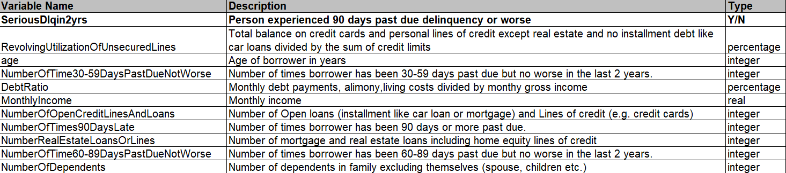
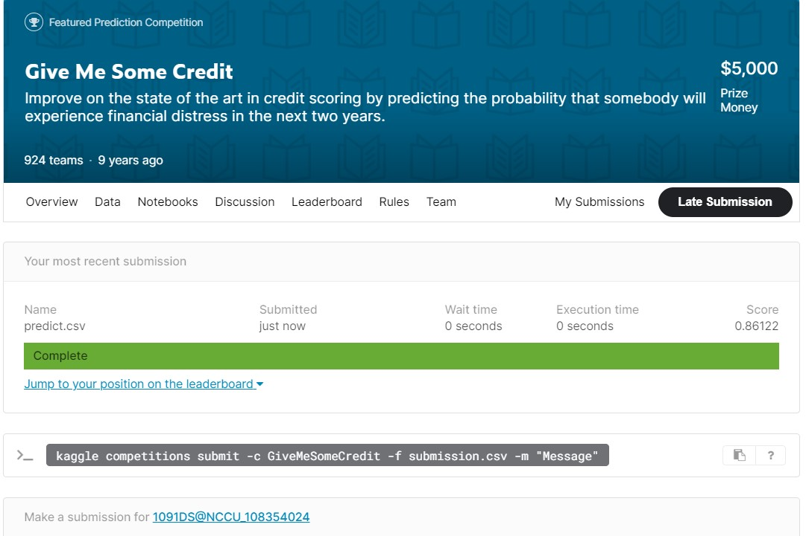

# kaggle : give me some credit
kaggle資料集分析(二元分類)

* 資料型態 : 150000 x 11 

id|SD2yrs|Revo|age|PDNW|DebtRatio|MonthlyIncome|NOOCLAL|NOT90DL|NRELOL|NOTDPDNW|NOD
---|---|---|---|---|---|---|---|---|---|---|---
1|1|0.766|45|2|0.802|9120|13|0|6|0|2
2|0|0.957|40|0|0.121|2600|4|0|0|0|1
3|0|0.658|38|1|0.085|3042|2|1|0|0|0
4|0|0.233|30|0|0.036|3300|5|0|0|0|0
5|0|0.907|49|1|0.024|63588|7|0|1|0|0

* feature 

* target 
預測客戶逾期繳款的機率

* 評估方式 
metric

* model 
xgboost

* result 
AUC = 0.86 

